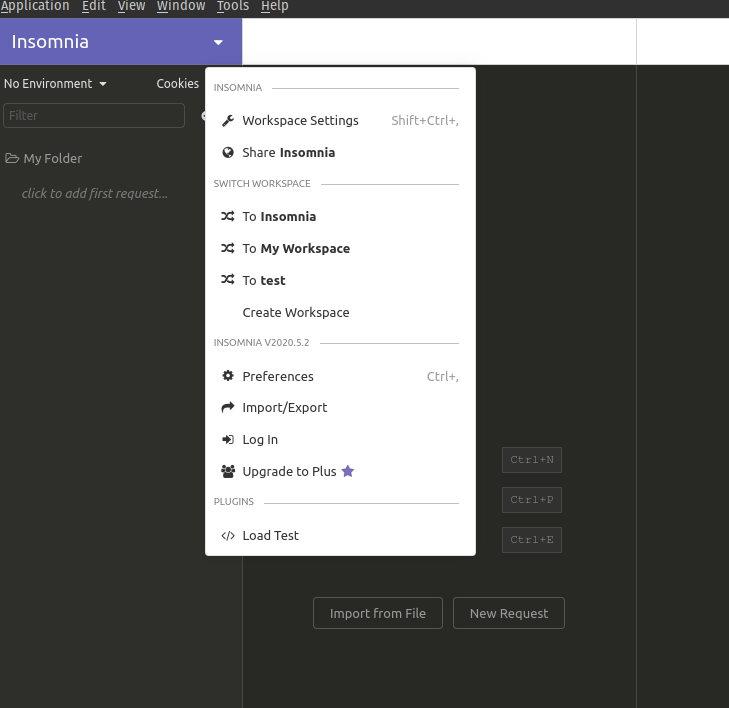
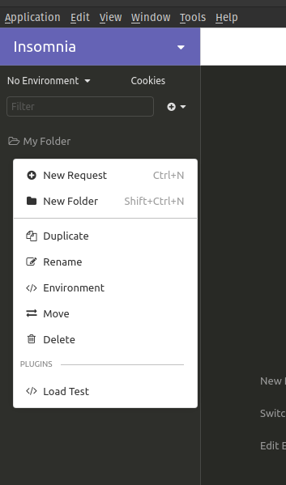

# insomnia-plugin-load-test-timing

This plugin adds an option to each folder's and workspace's drop-down menu that allows you to run all the requests in the folder and gather timing information.

## Folder or Workspace

Because of the restrictions from Insomnia, we can not detect requests in the sub folders. So we implemented a `Load Test` function for the workspace. If you want to test all the requests in the workspace, use the workspace menu.  

## Input Dialogs

When run, you will be asked three questions:

### # Iterations

The number of times to issue the requests for all the requests in the folder

### # Seconds

Delay between request runs, in seconds.

### # Run in parallel

If yes, it will run all requests in folder for each run. If no, it will run each request serially.

## Progress Bar

There will be a progress bar while requests are in progress.

## Output Table

When the runs are finished you will be presented with tabular result set showing the average and total timings of each request in the folder.

The `Successes` column will show the # of successful http requests and `Fails` column will show the # of failed http requests that sent out. Ideally, the number in this column is equal to the [# Iterations] \* [# requests in folder]. If it is not equal to this, then the number of failures is ([# Iterations] \_ [# requests in folder]) \* [# of requests that returned a non 2xx status code], and it will be colored RED for failure. A correct # of successes will be colored GREEN.

The results are shown in a separate windows, so you can compare different test results visually.  

## How to Install

This plugin is published in [npm](https://www.npmjs.com/package/insomnia-plugin-load-test-timing). To use it you can install it from your [insomnia.rest](https://insomnia.rest/) client by going into **Preferences -> Plugins** and entering the package name `insomnia-plugin-load-test-timing` then click "Install Plugin".
